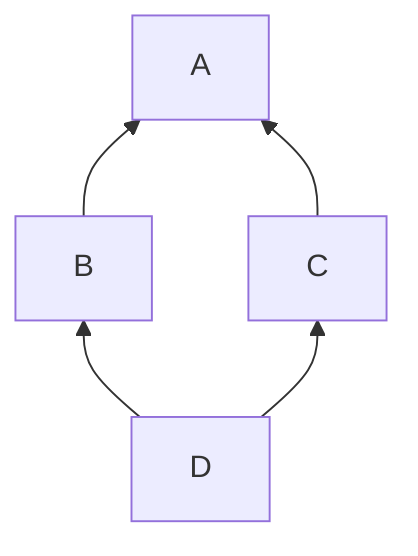

#22Mar2022

# Method Resolution Order

### Diamond problem: multi inheritance

```python
class A:
    def rk(self):
        print("In class A")
class B(A):
    def rk(self):
        print("In class B")
class C(A):
    def rk(self):
        print("In class C")
  
# classes ordering
class D(B, C):
    pass
     
r = D()
r.rk()
# In class B
```



### Linearisation

The order in which the base classes are searched when executing a method.


### MRO

Method Resolution Order (MRO) is an <u>algorithm</u> for the construction of linearisation - the list of all the ancestors of a class, including the class itself, ordered from the closest to the furthest. This is the order in which methods and attributes are looked up.

- In the above `diamond problem`, the lookup order of `D` is `D -> B -> C -> A`

In `python`, [C3 linearisation](24Mar2022_C3_linearisation.md) is being used.

---

#python #inheritance #MRO #C3

---

Source: 

- https://levelup.gitconnected.com/method-resolution-order-in-python-5afbaecc25e0
- https://www.geeksforgeeks.org/method-resolution-order-in-python-inheritance/3