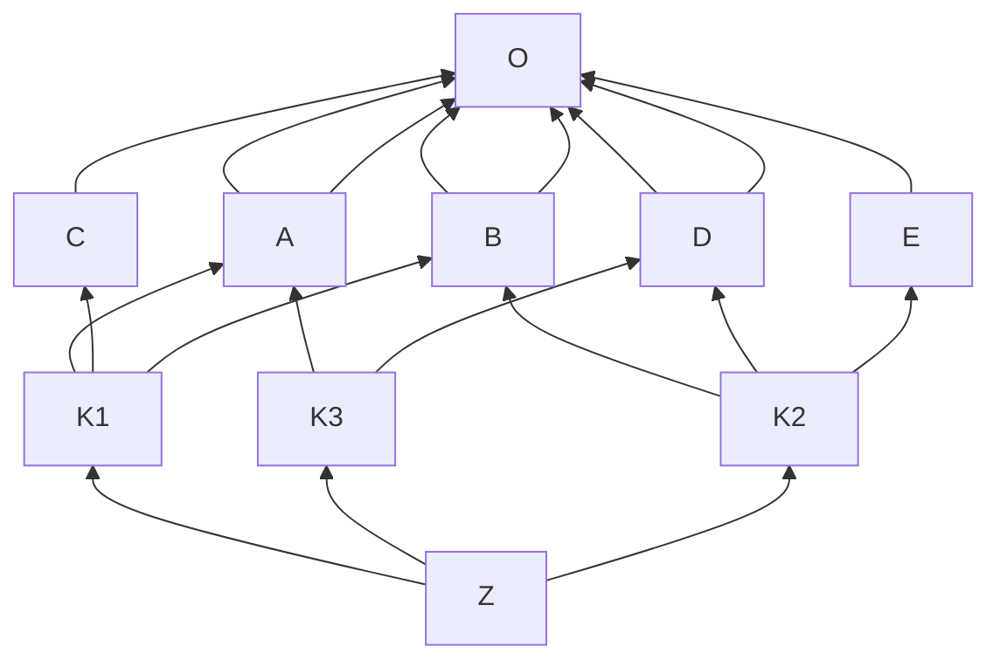

#24Mar2022

### C3 Linearisation Algorithm

- Inheritance graph determines the structure of [method resolution order](22Mar2022_MRO.md).
- User have to visit the super class only after the method of the local classes are visited.
- Monotonicity

This is done by 

1. Select the first head of the lists which does not appear in the tail (all elements of a list except the first) of any of the lists;
2. A good head might also appear in multiple lists, however, it cannot appear anywhere else
3. Once an element is selected, it needs to be removed in the `good head` consideration and appended to the output list
4. The process will terminate once the lists are exhausted
5. If there is no good head to be chosen(every head appears in the tail of other lists), it means `linearisation` does not exist.


### simple case

```python
class A:
    def rk(self):
        print(" In class A")
class B:
    def rk(self):
        print(" In class B")
  
# classes ordering
class C(A, B):
    def __init__(self):
        print("Constructor C")
  
r = C()
# Constructor C

# it prints the lookup order 
print(C.__mro__) # or print(C.mro())
# (<class '__main__.C'>, <class '__main__.A'>, <class '__main__.B'>, <class 'object'>)
```


### complicated case

```python
class Type(type):  
  def __repr__(cls):
        return cls.__name__

class O(object, metaclass=Type): 
    pass

class A(O): pass
class B(O): pass
class C(O): pass
class D(O): pass
class E(O): pass
class K1(A, C, B): pass 
class K3(A, D): pass
class K2(B, D, E): pass
class Z(K1, K3, K2): pass

print(Z.mro())
# [Z, K1, K3, A, C, K2, B, D, E, O, <class 'object'>]
```

- `K1` is the first coming list; 
-  `A` appears in tail of next list, so jump to `K3`;
- `A` does not appear as tail in any coming lists, so next is `A` , so does `C`;
- `B/D` appear in tail of other lists, so jump to `K2`;
- `B/D` now are `good head`s, add them in;
- `E` is a good head;
- Only `O` is left now.




### Question 

- If in the complicated case, both `K1` and  `K2` have new dependency, what will happen?

  ```python
  class K1(A, B, C): pass
  class K3(A, D): pass
  class K2(B, E): pass
  ```

  - Answer 

    ```bash
    # [Z, K1, K3, A, D, K2, B, C, E, O, <class 'object'>]
    ```

    

---

#python #inheritance #MRO #C3

---

Source: 

- https://en.wikipedia.org/wiki/C3_linearization#Example_demonstrated_in_Python_3